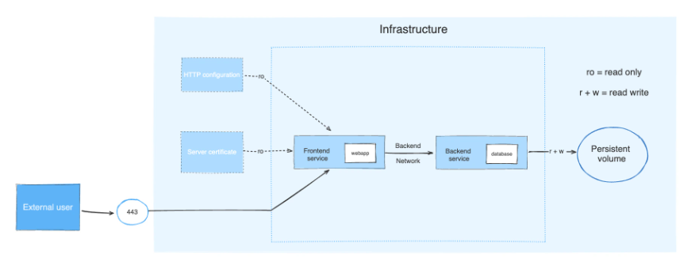

# Gochef Infrastructure

Each microservice is containerized and managed by Docker Compose. I use Docker Compose because I just need a simple deployment strategy for my application (All components will be deployed in a server).

Infrastructure with Docker Compose:



## Install Docker Compose

### Linux server

**Step 1:** Download and install the Docker Compose standalone:

```bash
sudo curl -SL https://github.com/docker/compose/releases/download/v2.30.3/docker-compose-linux-x86_64 -o /usr/local/bin/docker-compose
```

**Step 2:** Apply executable permissions to the standalone binary in the target path for the installation:

```bash
sudo chmod +x /usr/local/bin/docker-compose
```

**Step 3:** Verify that Docker Compose is installed:

```bash
docker-compose version
```

## Setup Infrastructure for Gochef Application

**Step 1:** From root project directory, startup application by running:

```bash
docker compose --env-file .env.local up -d
```

**Step 2:** Verify that application is running:

```bash
docker ps
```